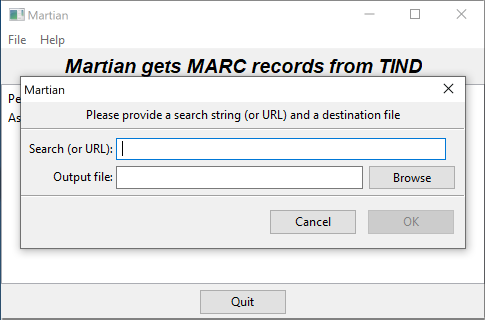

Martian
=======

_Martian_ searches Caltech's TIND.io database with a user-specified query and downloads the MARC XML records produced. The name "Martian" is a loose acronym for _**<ins>MAR</ins>C from <ins>TI</ins>ND <ins>A</ins>ssista<ins>n</ins>t**_.

*Authors*:      [Michael Hucka](http://github.com/mhucka)<br>
*Repository*:   [https://github.com/caltechlibrary/martian](https://github.com/caltechlibrary/martian)<br>
*License*:      BSD/MIT derivative &ndash; see the [LICENSE](LICENSE) file for more information

[](https://choosealicense.com/licenses/bsd-3-clause)
[](https://www.python.org/downloads/release/python-380/)
[](http://github.com/caltechlibrary/martian)


Table of Contents
-----------------
* [Introduction](#-introduction)
* [Installation](#-installation)
* [Usage](#-usage)
* [Known issues and limitations](#-known-issues-and-limitations)
* [Getting help](#-getting-help)
* [Contributing](#-contributing)
* [License](#-license)
* [Authors and history](#-authors-and-history)
* [Acknowledgments](#acknowledgments)


☀ Introduction
-----------------------------

Caltech's librarians occasionally need to download large numbers of records from Caltech's TIND.io database.  Doing this through TIND's web interface is tedious because TIND.io does not provide a bulk download facility.  Martian is a program to make this work easier.  It performs one simple task: run a query in caltech.tind.io and download all the results in MARC XML format to a file on the local computer.


✺ Installation
-------------

### Using the normal installer program

The developers provide an installer program for Caltech Library users.  Please contact the developers to get a copy of the installer program for Windows 7, Windows 10, or macOS 10.12+.  Note also that installation of Martian on Windows requires administrator priviledges.

To uninstall Martian on a Windows 10 system, use the normal Windows **Add or remove programs** facility in the **Systems Settings** panel.


### Using the source code repository

On **Linux**, **macOS**, and **Windows** operating systems, you should be able to install Martian directly from the GitHub repository using [pip](https://pip.pypa.io/en/stable/installing/).  If you don't have the `pip` package or are uncertain if you do, first run the following command in a terminal command line interpreter:

```
sudo python3 -m ensurepip
```

Then, install this software by running the following command on your computer:
```sh
python3 -m pip install git+https://github.com/caltechlibrary/martian.git --user --upgrade 
```

Alternatively, you can clone this GitHub repository and then run `setup.py`:
```sh
git clone https://github.com/caltechlibrary/martian.git
cd martian
python3 -m pip install . --user --upgrade
```

If you install Martian in this way (from the sources), you may run into compatibility problems with the installation of the Python `pycurl` package.  Some notes and tips about installation can be found in the [wiki for Martian](https://github.com/caltechlibrary/martian/wiki).


▶︎ Usage
-------

Martian is simple in operation and has a correspondingly simple interface. The interface has two modes of operation: using a graphical user interface (GUI), or using the command-line.

When installed on a Windows system using the installer provided by the developers, Martian only has a GUI interface and will always run in GUI mode.  When installed using the Python module installation method on Linux, macOS or Windows, Martian also provides a simple command-line interface program called `martian`.  Martian can then be invoked by running `martian` from a terminal emulator program or, alternatively, using `python -m martian` (assuming your `python` is Python version 3).

### Running Martian using the GUI interface



On Windows or other environment where the GUI version of Martian is available, start Martian normally as you would any other program (e.g., by double-clicking Martian's program icon).

When Martian starts up, it prints some messages about its progress in the main window then immediately brings up a dialog with two fields to be filled in by the user.  The first field ("Search (or URL)") can be either a search string as one would type into the caltech.tind.io search field, or alternatively, a complete search URL (e.g., copied from a web browser's address bar after performing some exploratory searches in caltech.tind.io).  The second field is used to specify where the output should be written.  The output file can be either typed in manually, or the "Browse" button can be used to choose a folder and file name.

After the user types in a search query string and indicates where the output should be written, and clicks the **OK** button, the program does the following behind the scenes:

1. Searches Caltech.tind.io with the query string
2. Downloads the data returned by TIND in a loop until there is no more data
3. Writes the output file

Martian prints messages about its progress as it runs.  Program execution can be interrupted by clicking the **Quit** button on the main screen after the first dialog panel is closed.


### Running Martian using the command-line interface

For help with usage at any time, run `martian` with the option `-h` (or `/h` on Windows).

By default, the command-line interface will start a GUI to get information from the user and tell the user about progress while it runs.  If given the `-G` option (`/G` on Windows), it does not start the GUI.

When running without the GUI, Martian takes one required argument on the command line: the query string to use for the search in TIND.  Alternatively, the command-line argument can be a complete search URL as would be typed into a web browser (or more practically, copied from the browser address bar after performing some exploratory searches in caltech.tind.io).  It is best to quote the search string, using double quotes on Windows and single quotes on Linux/Unix, to avoid terminal shells interpreting special characters such as question marks in the search string.  Example (for Windows):

```
martian "https://caltech.tind.io/search?ln=en&p=856%3A%27ebrary%27"
```

If given the `-t` option (`/t` on Windows), it will only fetch and process a total of that many results instead of all results.  If given the `-s` (`/s` on Windows) option, it will start at that entry instead of starting at number 1; this is useful if searches are being done in batches or a previous search is interrupted and you don't want to restart from 1.

If given an output file using the `-o` option (`/o` on Windows), the results will be written to that file.  If no output file is specified, the output is written to a file named `output.xml` on the user's desktop.  The results are always MARC records in XML format.

If given the `-@` argument (`/@` on Windows), this program will output a detailed trace of what it is doing, and will also drop into a debugger upon the occurrence of any errors.  The debug trace will be written to the given destination, which can be `-` to indicate console output, or a file path to send the output to a file.

If given the `-V` option (`/V` on Windows), this program will print version information and exit without doing anything else.


⚑ Known issues and limitations
-------------------------------

Here are some of the current limitations of Martian:

* Because Martian gets data from TIND.io in batches of 200 at a time, interrupting Martian while it's running may result in either getting no data at all (if there is less than 200 to download) or getting up to 200 less than what it printed as its current progress point.
* The GUI interface currently does not provide a way to indicate that Martian should get fewer than the maximum number of records returned by a given search, nor a way to indicate a starting record.  However, the command-line interface does provide options for setting these parameters at run time.  To start from a specific result instead of the first result in a particular search, it's currently necessary to use the command-line interface.
* The choice of download format (which is MARC XML as produced by TIND.io), and the number of records it attempts to get per iteration (200) are currently fixed and hardwired into the program.


⁇ Getting help
-------------

If you find an issue, please submit it in [the GitHub issue tracker](https://github.com/caltechlibrary/martian/issues) for this repository.


♬ Contributing
-------------

We would be happy to receive your help and participation with enhancing Martian!  Please visit the [guidelines for contributing](CONTRIBUTING.md) for some tips on getting started.


☮︎ License
---------

Copyright (C) 2019-2021, Caltech.  This software is freely distributed under a BSD/MIT type license.  Please see the [LICENSE](LICENSE) file for more information.


❡ Authors and history
--------------------

[Mike Hucka](https://github.com/mhucka) designed and implemented Martian based on requests from [Laurel Narizny](https://github.com/lnarizny) in mid-2019.


☺︎ Acknowledgments
------------------

The [vector artwork](https://thenounproject.com/search/?q=martian&i=63049) of an alien spaceship used as a starting point for the logo for this repository was created by [Gonzalo Bravo](https://thenounproject.com/webposible/) for the [Noun Project](https://thenounproject.com).  It is licensed under the Creative Commons [Attribution 3.0 Unported](https://creativecommons.org/licenses/by/3.0/deed.en) license.  The vector graphics was modified by Mike Hucka to change the color.

Martian makes use of numerous open-source packages, without which it would have been effectively impossible to develop Martian with the resources we had.  We want to acknowledge this debt.  In alphabetical order, the packages are:

* [Beautiful Soup](https://www.crummy.com/software/BeautifulSoup/) &ndash; an HTML parsing library
* [certifi](https://github.com/certifi/python-certifi) &ndash; Root Certificates for validating the trustworthiness of SSL certificates
* [colorama](https://github.com/tartley/colorama) &ndash; makes ANSI escape character sequences work under MS Windows terminals
* [halo](https://github.com/ManrajGrover/halo) &ndash; busy-spinners for Python command-line programs
* [humanize](https://github.com/jmoiron/humanize) &ndash; make numbers more easily readable by humans
* [ipdb](https://github.com/gotcha/ipdb) &ndash; the IPython debugger
* [lxml](https://lxml.de) &ndash; an XML parsing library for Python
* [plac](http://micheles.github.io/plac/) &ndash; a command line argument parser
* [pycurl](http://pycurl.io) &ndash; Python interface to libcurl, a library for downloading data identified by URLs
* [PyInstaller](http://www.pyinstaller.org) &ndash; a packaging program that creates standalone applications from Python programs for Windows, macOS, Linux and other platforms
* [pypubsub](https://github.com/schollii/pypubsub) &ndash; a publish-and-subscribe message-passing library for Python
* [requests](http://docs.python-requests.org) &ndash; an HTTP library for Python
* [setuptools](https://github.com/pypa/setuptools) &ndash; library for `setup.py`
* [termcolor](https://pypi.org/project/termcolor/) &ndash; ANSI color formatting for output in terminal
* [urllib3](https://urllib3.readthedocs.io/en/latest/) &ndash; a powerful HTTP library for Python
* [wxPython](https://wxpython.org) &ndash; a cross-platform GUI toolkit for the Python language

Finally, we are grateful for computing &amp; institutional resources made available by the California Institute of Technology.
    
<div align="center">
  <a href="https://www.caltech.edu">
    
  </a>
</div>
